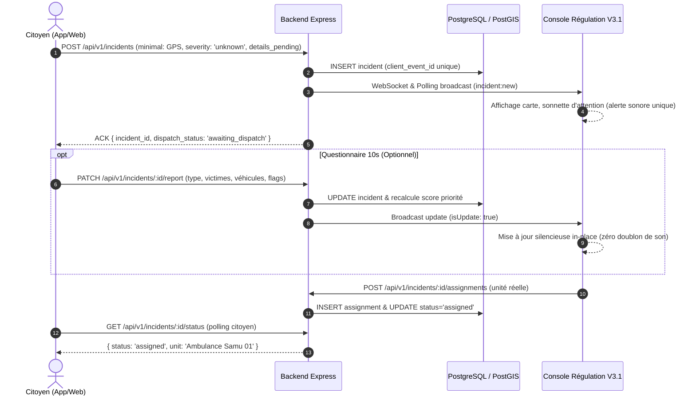

# Contrat d’intégration mobile ↔ backend ↔ web LOTISEC

## Architecture opérationnelle réelle

L’application mobile ne communique pas directement avec le navigateur de l’opérateur. Elle transmet le signalement au backend Express TypeScript. Le backend valide les données, les persiste dans PostgreSQL/PostGIS, puis diffuse l’événement via WebSocket natif (`/ws/alertes`) et API REST (`/api/v1/incidents`). Cette séparation garantit l’authentification, la traçabilité, le dédoublonnage et la reprise après coupure réseau.

```text
Application mobile / Web citoyen → API Express TypeScript → PostgreSQL/PostGIS → WebSocket & REST Polling → Console Opérationnelle
```

Le module `src/services/mobileGateway.js` contient le contrat exécutable côté Console : configuration, normalisation honnête, mise à jour in-place sans fausse alarme (`isUpdate: true`), gestion des positions GPS et bascule test / réel.

---

## 1. Cycle de vie d'un incident d'urgence



---

## 2. Structure normalisée du signalement citoyen

Le backend et la console s'accordent sur le schéma sans inventer d'information manquante :

```json
{
  "id": "c7a6e15e-f001-4999-9801-4601170aa001",
  "source": "mobile",
  "type": "Urgence citoyenne",
  "severity": "unknown",
  "latitude": 6.1725,
  "longitude": 1.2215,
  "accuracy": 8.5,
  "address": "Position GPS mobile",
  "victims": 0,
  "vehicles": 0,
  "flags": ["details_pending", "victims_unknown", "vehicles_unknown"],
  "client_event_id": "mobile-anon-1726135000000-abcd",
  "created_at": "2026-09-12T10:00:00.000Z"
}
```

### Règles d'honnêteté des données :
1. **Sévérité non présumée** : `severity` vaut `'unknown'` (affiché *« À évaluer »* sur la console) tant qu'un opérateur ou le questionnaire d'enrichissement n'a pas statué.
2. **Victimes & Véhicules** : Ne sont jamais forcés à `1`. S'ils ne sont pas précisés, ils valent `0` avec le flag `victims_unknown` / `vehicles_unknown`, et s'affichent *« Non renseigné »*.
3. **Score de priorité dynamique** : Les drapeaux critiques (`inconscience`, `saignement`, `coince`, `feu`) augmentent directement le score d'urgence même si la sévérité déclarée est encore `unknown`.
4. **Pas d'affectation fantôme** : Tant qu'un régulateur n'a pas confirmé l'envoi d'une unité réelle, le statut reste `awaiting_dispatch`. L'application mobile n'invente jamais d'ambulance ou d'hôpital fictif.

---

## 3. Endpoints REST Clés

| Méthode | Route | Rôle |
|---|---|---|
| `POST` | `/api/v1/incidents` | Déclenchement SOS minimaliste avec dédoublonnage par `client_event_id` |
| `PATCH` | `/api/v1/incidents/:id/report` | Enrichissement citoyen ou opérateur (retire `details_pending`) |
| `PATCH` | `/api/v1/incidents/:id/status` | Changement de statut d'incident (annulation citoyenne ou clôture régulation) |
| `GET` | `/api/v1/incidents/:id/status` | Suivi public sécurisé du statut et de l'unité affectée |
| `POST` | `/api/v1/incidents/:id/assignments` | Affectation d'un véhicule/équipe réel(le) à l'incident |
| `GET` | `/api/v1/resources` | Liste des véhicules et unités de secours opérationnelles |
| `GET` | `/api/v1/facilities` | Liste des hôpitaux et centres de santé récepteurs |

---

## 4. Séparation stricte Mode Test & Mode Réel

1. **Mode Test (`test`)** :
   - Environnement par défaut au chargement de la console.
   - Embarque le scénario guidé en 8 étapes pour les démonstrations et formations d'opérateurs.
   - Les événements réels reçus du terrain sont isolés dans `realEventQueue` sans perturber la carte ni les statistiques de test.
2. **Mode Réel (`real`)** :
   - Activé par la bascule d'environnement dans la barre latérale.
   - Charge les ressources réelles depuis `/api/v1/resources` et les hôpitaux depuis `/api/v1/facilities`.
   - Les interventions déclenchées depuis le mobile et le portail web y sont injectées en direct.
   - Les affectations et validations d'opérateurs sont persistées directement dans PostgreSQL.
3. **Gestion Sonore Impeccable** :
   - Le bip d'arrivée sur le Dashboard est garanti unique (`dashboardBeepPlayedRef`).
   - Les mises à jour et enrichissements d'incidents existants (`isUpdate: true`) sont traités in-place sans faire retentir d'alarme sonore supplémentaire.
